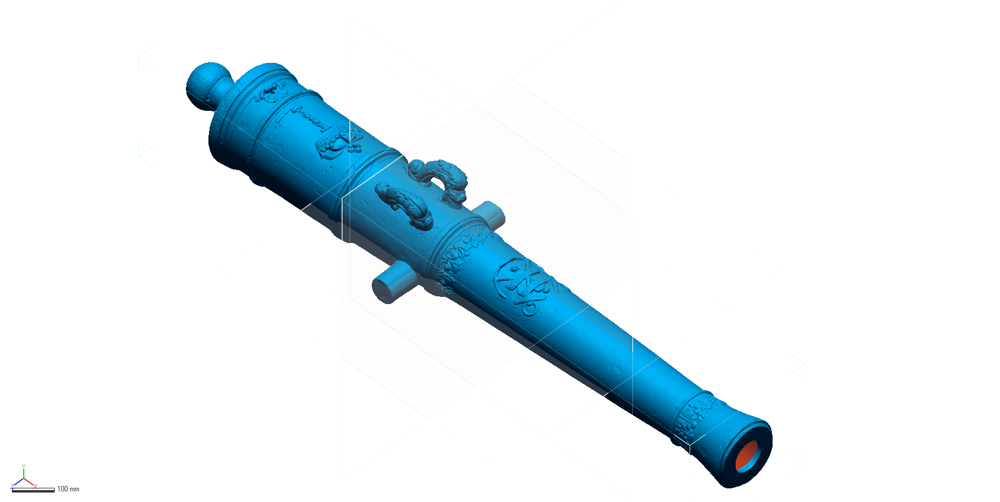

# labelle-cannon

The goal of this project was to scan and reverse engineer one of three bronze cannons (41MG86 - 11900-1) recovered from the La Belle excavation, which is currently on exhibit at the Bullock Texas State History Museum in Austin, Texas. A freeform computer aided design (CAD) model was generated based upon the topology of the 3D mesh in Geomagic Design X with a desired maximum deviation of 0.1 mm between the model and the mesh. Deviations were calculated in Geomagic Control X using the surface model as the reference data, and the mesh as the measured data. A custom patch network was designed using a series of iterative revisions until the whole of the surface model met with the specified tolerance. The 3D surface model of the cannon will be replicated in a variety of media at variable scales for use in exhibits and for educational and promotional material for the Texas Historical Commission, the Republic of France, and their partner museums.